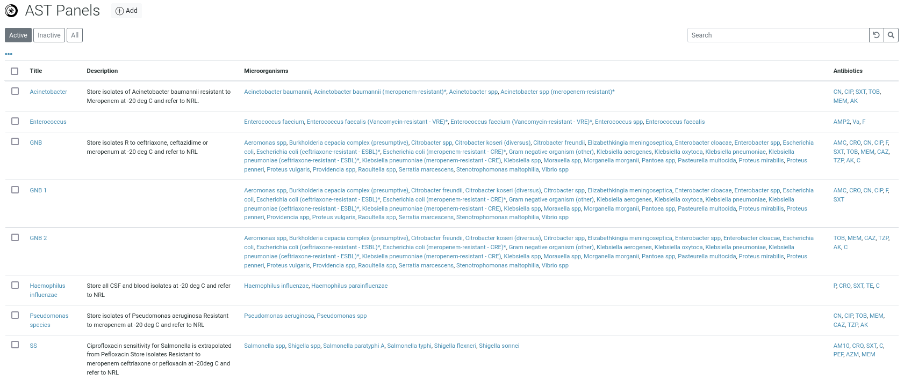
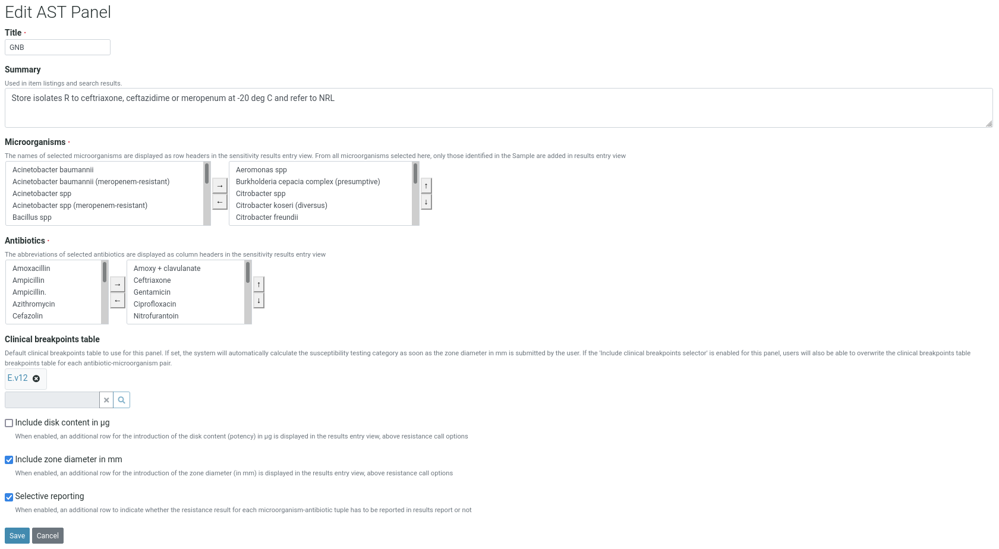
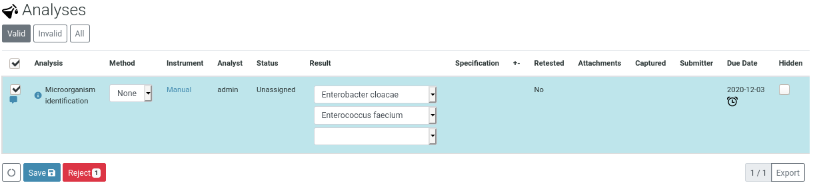
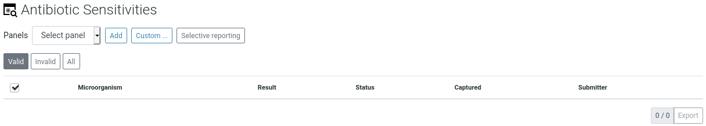
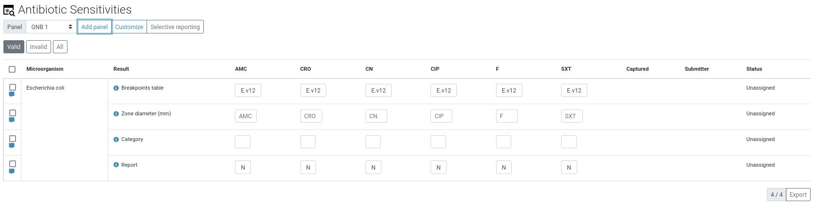
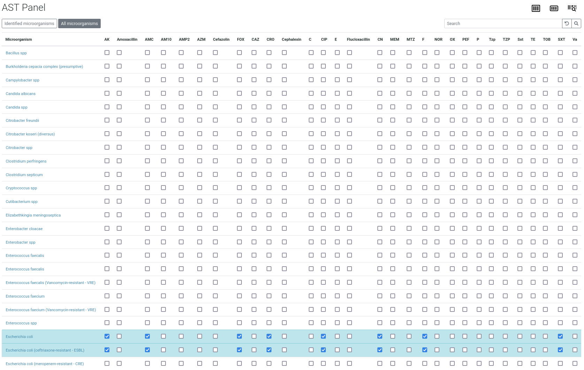
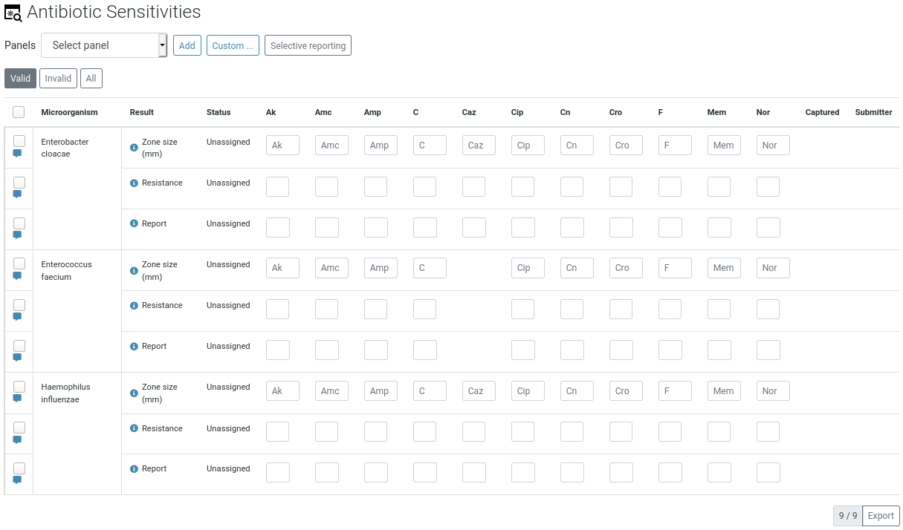
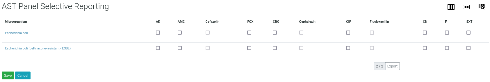

Quickstart
==========

This section gives an introduction about `senaite.ast`_. It assumes you
have `SENAITE LIMS`_ and ``senaite.ast`` already installed. Please read the
:doc:`installation` for further details.

.. _AddASTPanel:

Adding a pre-defined AST Panel
------------------------------

To add pre-defined AST Panels, click the "gear" icon from top right, go to
"AST Panels" view.

From this view, you can either create a new AST Panel or edit an existing one:

From this view, you can choose both the Microorganisms and the Antibiotics.
Please read the `documentation of senaite.microorganism`_ and the
`documentation of senaite.abx`_ for further details.

If a "Clinical breakpoints table" is selected, the system will automatically use
this breakpoints table to calculate the susceptibility testing category (S/I/R)
when the diameter of the inhibition zone is submitted by the user. Still, user
can change the breakpoints table to use for any given antibiotic and
microorganism later, on susceptibility testing results introduction.

If the option "Include disk content in ug" is selected, an additional row for
the introduction of the disk content (potency) in μg is displayed in the results
entry view, above resistance call options.

If the option "Include zone diameter in mm" is checked, besides the qualitative
analysis for antibiotic susceptibility, the system will also add analyses for
the capture of the zone of inhibition in mms automatically when this panel is
selected.

If the option "Selective reporting" is checked, the system will also add an
analysis to allow the user to indicate the resistance results to be displayed
in results report. If unchecked, all resistance results will be rendered.
Besides, this option also allows the user to choose the extrapolated antibotics
to be reported.

.. _MicroorganismIdentificationAnalysis:

Microorganism identification analysis
-------------------------------------

Besides AST Panels, this add-on creates a new analysis service with name
"Microorganism identification" and the category "Antibiotic Sensitivity Testing
(AST)" as well.

When this "Microorganism identification" service is assigned to a Sample (either
from Sample Add form or later, through "Manage analyses"), a new analysis with
pre-defined result options is added.

.. note:: The selection list of this type of analysis is populated with the
    microorganisms registered in the system that are in "active" status.

This analysis behaves as a multi-selection list, so the user can choose as many
microorganisms as required.

.. _AssignmentOfASTPanel:

Assignment of an AST Panel to a Sample
--------------------------------------

For the assignment of an AST Panel to a sample, go to sample view. Below the
analyses listing, a section for Sensitivity Testing is displayed:

Select one of the available AST Panels and press the button "Add". Analyses are
added automatically based on the settings of the AST Panel of choice.

.. note:: If no AST Panels are displayed, please check that at least one of the
    microorganisms identified (see :ref:`MicroorganismIdentificationAnalysis`)
    is assigned to a pre-defined AST Panel.

You can add as many AST Panels as you wish, but only identified microorganisms
will be added by default. Microorganisms are displayed in rows and Antibotics
(abbreviations) in columns.

.. _CustomASTPanel:

Custom AST Panel for a Sample
-----------------------------

Sometimes user might want to add additional microorganisms, even if they were
not initially identified or add new Antibiotics, even if they weren't defined
in the pre-defined AST Panel of choice.

From same view, press the "Custom" button and a matrix with microorganisms as
rows and antibiotics as columns is displayed for easy selection. By default,
only microorganisms identified are displayed. However, user can press "All
microorganisms" button to extend the list with the rest of microorganisms
registered in the system:

.. note:: System allows unbalanced entries, so user can choose different
    antibiotics for different microorganisms at will.

Once the button "Save" is pressed, the user is redirected to the Sample view
and the list of AST analyses is updated accordingly:

.. _SelectiveReporting:

Selective reporting
-------------------

User can easily set the resistance results to be included in the results report
by means of the "Report" analysis. However, there is also the option to define
the selective reporting all-at-once. Press the "Selective reporting" button and
a matrix with microorganisms as rows and antibiotics as columns is displayed
for easy selection.

From this view, user can choose the tuples Microorganism-Antibiotic to be
reported in results. Once the button "Save" is pressed, the value for analyses
with name "Report" for all microorganisms are updated accordingly.

.. Links

.. _SENAITE LIMS: https://www.senaite.com
.. _senaite.ast: https://pypi.python.org/pypi/senaite.ast
.. _documentation of senaite.abx: https://senaiteabx.readthedocs.io/en/latest/
.. _documentation of senaite.microorganism: https://senaitemicroorganism.readthedocs.io/en/latest/
